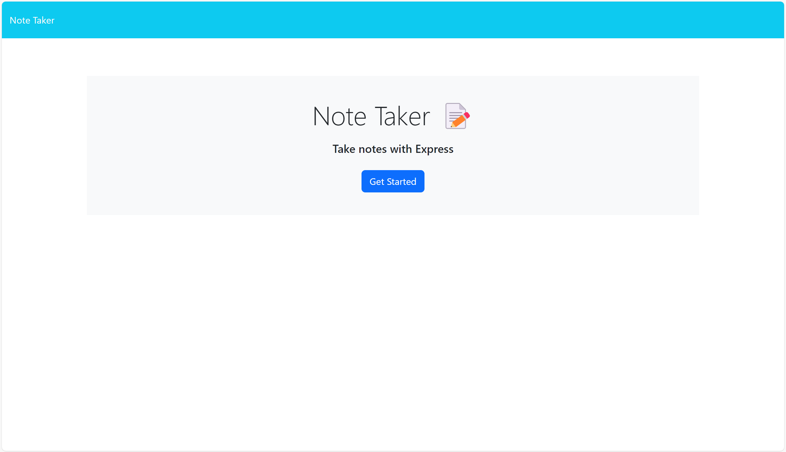

# Taking-Notes

## Description
    In this challenge we are you using express to make a note taker, so that you can take notes. It is simple to use you just enter in the info you want and save and also you can delete to. So you can use this not only as a note taker but maybe also a planner.

## Bulit with
    - Express
    - node js

## Project links.
    -https://shawki45.github.io/Taking-Notes/
    - git@github.com:Shawki45/Taking-Notes.git

## Sources
    - Instructors and tutors.
    - w3schools
    -mdn
    -youtube
    -stackoverflow.

## Screenshot

